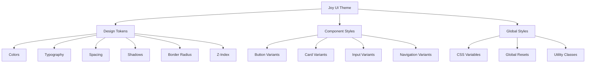
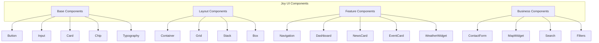
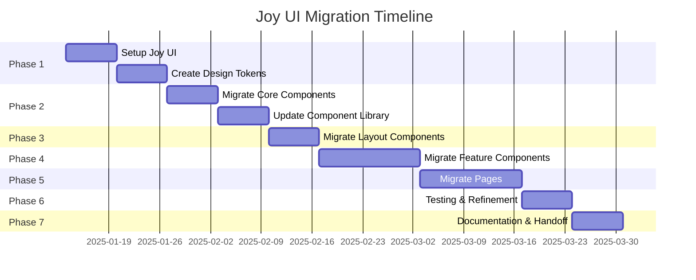

# Joy UI Migration Plan - Radzyń City Portal

## Executive Summary

This document outlines the comprehensive migration strategy for transitioning the Radzyń City Portal from Material UI (MUI) v6 to Joy UI. The migration aims to create a unified, modern design system that maintains the baroque-inspired aesthetic while leveraging Joy UI's modern component architecture.

**Status**: Ready for Implementation
**Version**: 2.0
**Last Updated**: 2026-01-11
**Target Completion**: 11 weeks from start

---

## Table of Contents

1. [Current State Analysis](#current-state-analysis)
2. [Business Requirements & Questions](#business-requirements--questions)
3. [Design System Architecture](#design-system-architecture)
4. [Component Mapping Strategy](#component-mapping-strategy)
5. [Migration Phases](#migration-phases)
6. [Mock Data Requirements](#mock-data-requirements)
7. [Design Principles](#design-principles)
8. [Implementation Roadmap](#implementation-roadmap)

---

## Current State Analysis

### Technology Stack

| Component | Current | Target |
|-----------|---------|--------|
| UI Framework | Material UI v6 | Joy UI |
| Styling | Tailwind CSS + MUI sx prop | Joy UI CSS Variables + sx prop |
| Theme System | MUI Theme | Joy UI Theme |
| Icons | @mui/icons-material | @mui/icons-material (compatible) |
| State Management | React Context | React Context (unchanged) |
| Framework | Next.js 14 | Next.js 14 (unchanged) |

### Current Components Inventory

#### Core Components (src/components/)
- [`Navigation.tsx`](../src/components/Navigation.tsx) - AppBar, Toolbar, Drawer, Menu
- [`NewsCard.tsx`](../src/components/NewsCard.tsx) - Card, CardMedia, CardContent, Chip
- [`EventCard.tsx`](../src/components/EventCard.tsx) - Card, Menu, MenuItem
- [`Dashboard.tsx`](../src/components/Dashboard.tsx) - Grid, Box, Container
- [`DashboardWidget.tsx`](../src/components/DashboardWidget.tsx) - Card, CardHeader, Skeleton
- [`WeatherWidget.tsx`](../src/components/WeatherWidget.tsx) - Alert, CircularProgress, Paper
- [`ContactForm.tsx`](../src/components/ContactForm.tsx) - TextField, Button, FormControl
- [`Map.tsx`](../src/components/Map.tsx) - Leaflet integration (unchanged)
- [`NewsFeed.tsx`](../src/components/NewsFeed.tsx) - Grid, Alert, Skeleton
- [`CityHighlights.tsx`](../src/components/CityHighlights.tsx) - Card, CardContent
- [`PlaceholderImage.tsx`](../src/components/PlaceholderImage.tsx) - Box, Skeleton
- [`ThemeRegistry.tsx`](../src/components/ThemeRegistry.tsx) - ThemeProvider, CssBaseline

#### Pages (src/app/)
- [`page.tsx`](../src/app/page.tsx) - Homepage with dashboard widgets
- [`layout.tsx`](../src/app/layout.tsx) - Root layout with navigation
- [`city/page.tsx`](../src/app/city/page.tsx) - City information
- [`county/page.tsx`](../src/app/county/page.tsx) - County information
- [`map/page.tsx`](../src/app/map/page.tsx) - Map page
- [`places/page.tsx`](../src/app/places/page.tsx) - Places directory
- [`events/page.tsx`](../src/app/events/page.tsx) - Events calendar
- [`news/page.tsx`](../src/app/news/page.tsx) - News listing
- [`contact/page.tsx`](../src/app/contact/page.tsx) - Contact form
- [`pogoda/page.tsx`](../src/app/pogoda/page.tsx) - Weather page
- [`admin/`](../src/app/admin/) - Admin interface

### Current Design Issues Identified

1. **Inconsistent Styling**: Mix of Tailwind CSS classes and MUI sx props
2. **Fragmented Theme**: Custom theme overrides scattered across components
3. **No Design Tokens**: Hardcoded values instead of design tokens
4. **Inconsistent Spacing**: Various spacing values without systematic approach
5. **Color Inconsistency**: Multiple color definitions (theme, globals.css, inline)
6. **Typography Inconsistency**: Mixed font families and sizes
7. **Component Variants**: No systematic variant system
8. **Responsive Patterns**: Inconsistent breakpoint usage

---

## Business Requirements & Questions

### Questions for Business Analytics

#### User Experience & Target Audience
1. **Primary User Groups**: Who are the main users of the portal? (residents, tourists, businesses, government officials)
2. **Device Usage**: What are the primary devices used? (mobile, tablet, desktop)
3. **Accessibility Requirements**: Are there specific WCAG compliance requirements?
4. **Language Support**: Is multilingual support required? (currently Polish only)

#### Content Strategy
5. **Content Priorities**: Which content types are most important? (news, events, places, weather)
6. **Update Frequency**: How often will content be updated? (daily, weekly, monthly)
7. **Content Sources**: Are there official content sources that need integration?

#### Functional Requirements
8. **User Accounts**: Is user authentication required? (for comments, submissions, favorites)
9. **Notifications**: Are push notifications or email alerts needed?
10. **Search Functionality**: What search capabilities are required? (full-text, filters, location-based)
11. **Social Features**: Are social sharing, comments, or user-generated content needed?

#### Performance & Technical
12. **Performance Targets**: What are the acceptable load times? (LCP, FID, CLS)
13. **SEO Requirements**: Are there specific SEO requirements or targets?
14. **Analytics**: What analytics and tracking are required?

#### Brand & Design
15. **Brand Guidelines**: Are there official brand guidelines or style guides?
16. **Color Palette**: Are there official brand colors beyond the current baroque theme?
17. **Typography**: Are there official font requirements?
18. **Logo & Assets**: Are there official logos and brand assets?

#### Future Roadmap
19. **Planned Features**: What features are planned for the next 6-12 months?
20. **Integration Needs**: Are there third-party integrations planned? (payment, booking, social media)

### Assumptions (to be validated)

| Assumption | Validation Needed |
|------------|-------------------|
| Primary users are residents and tourists | Confirm with analytics |
| Mobile-first approach is appropriate | Verify device usage data |
| Polish language only is sufficient | Confirm multilingual needs |
| No user authentication required initially | Confirm with stakeholders |
| WCAG 2.1 AA compliance is required | Confirm accessibility requirements |
| Performance budget: LCP < 2.5s | Confirm with stakeholders |

---

## Design System Architecture

### Joy UI Theme Structure



### Design Token System

#### Color Palette (Baroque-Inspired)

```typescript
// Primary Colors
const primary = {
  50: '#E8EDF5',
  100: '#D4DEEB',
  200: '#B5C6DD',
  300: '#8FA9CB',
  400: '#6B8CB9',
  500: '#25456B',  // Main primary
  600: '#1E3856',
  700: '#172B42',
  800: '#101F2E',
  900: '#0A141F',
};

// Secondary Colors (Gold)
const secondary = {
  50: '#FDF6E8',
  100: '#FCE9C5',
  200: '#F9D69B',
  300: '#F6C271',
  400: '#F3AE47',
  500: '#BE9C55',  // Main secondary
  600: '#9F7F3A',
  700: '#80622F',
  800: '#614624',
  900: '#422A19',
};

// Semantic Colors
const semantic = {
  success: {
    main: '#556B4F',
    light: '#718A69',
    dark: '#405039',
  },
  warning: {
    main: '#B2734F',
    light: '#C79070',
    dark: '#8E5A3C',
  },
  error: {
    main: '#8B3A41',
    light: '#A55961',
    dark: '#6D2A30',
  },
  info: {
    main: '#5D7895',
    light: '#7B93AC',
    dark: '#465C74',
  },
};

// Neutral Colors
const neutral = {
  0: '#FFFFFF',
  50: '#F9F7F2',
  100: '#F2EFE8',
  200: '#E5E0D5',
  300: '#D5CFC2',
  400: '#B8B2A3',
  500: '#9A9385',
  600: '#7D7668',
  700: '#635C4F',
  800: '#4A4539',
  900: '#2A2A2A',
  1000: '#000000',
};
```

#### Typography Scale

```typescript
const typography = {
  fontFamily: {
    display: '"Playfair Display", serif',
    body: '"Source Sans Pro", "Montserrat", sans-serif',
    mono: '"Fira Code", monospace',
  },
  fontSize: {
    xs: '0.75rem',    // 12px
    sm: '0.875rem',   // 14px
    md: '1rem',       // 16px
    lg: '1.125rem',   // 18px
    xl: '1.25rem',    // 20px
    '2xl': '1.5rem',  // 24px
    '3xl': '1.875rem', // 30px
    '4xl': '2.25rem', // 36px
    '5xl': '3rem',    // 48px
    '6xl': '3.75rem', // 60px
  },
  fontWeight: {
    light: 300,
    regular: 400,
    medium: 500,
    semibold: 600,
    bold: 700,
  },
  lineHeight: {
    tight: 1.25,
    normal: 1.5,
    relaxed: 1.75,
  },
  letterSpacing: {
    tighter: '-0.05em',
    tight: '-0.025em',
    normal: '0',
    wide: '0.025em',
    wider: '0.05em',
    widest: '0.1em',
  },
};
```

#### Spacing Scale

```typescript
const spacing = {
  0: '0',
  1: '0.25rem',  // 4px
  2: '0.5rem',   // 8px
  3: '0.75rem',  // 12px
  4: '1rem',     // 16px
  5: '1.25rem',  // 20px
  6: '1.5rem',   // 24px
  8: '2rem',     // 32px
  10: '2.5rem',  // 40px
  12: '3rem',    // 48px
  16: '4rem',    // 64px
  20: '5rem',    // 80px
  24: '6rem',    // 96px
};
```

#### Border Radius

```typescript
const borderRadius = {
  none: '0',
  sm: '0.25rem',  // 4px
  md: '0.5rem',   // 8px
  lg: '0.75rem',  // 12px
  xl: '1rem',     // 16px
  '2xl': '1.5rem', // 24px
  full: '9999px',
};
```

#### Shadows

```typescript
const shadows = {
  none: 'none',
  sm: '0 1px 2px 0 rgba(0, 0, 0, 0.05)',
  md: '0 4px 6px -1px rgba(0, 0, 0, 0.1)',
  lg: '0 10px 15px -3px rgba(0, 0, 0, 0.1)',
  xl: '0 20px 25px -5px rgba(0, 0, 0, 0.1)',
  '2xl': '0 25px 50px -12px rgba(0, 0, 0, 0.25)',
};
```

### Component Architecture



---

## Component Mapping Strategy

### MUI → Joy UI Component Mapping

| MUI Component | Joy UI Component | Migration Notes |
|---------------|------------------|-----------------|
| `Button` | `Button` | Direct mapping, update variants |
| `Card` | `Card` | Direct mapping, update styling |
| `CardHeader` | Custom component | Create Joy UI variant |
| `CardContent` | Custom component | Create Joy UI variant |
| `CardActions` | Custom component | Create Joy UI variant |
| `TextField` | `Input` | Update to Joy UI Input |
| `Select` | `Select` | Direct mapping |
| `MenuItem` | `Option` | Update to Joy UI Option |
| `Chip` | `Chip` | Direct mapping |
| `Alert` | `Alert` | Direct mapping |
| `Skeleton` | `Skeleton` | Direct mapping |
| `AppBar` | Custom component | Create Joy UI variant |
| `Toolbar` | Custom component | Create Joy UI variant |
| `Drawer` | `Sheet` | Update to Joy UI Sheet |
| `Dialog` | `Modal` | Update to Joy UI Modal |
| `Tabs` | `Tabs` | Direct mapping |
| `Tab` | `Tab` | Direct mapping |
| `Accordion` | `Accordion` | Direct mapping |
| `Divider` | `Divider` | Direct mapping |
| `IconButton` | `IconButton` | Direct mapping |
| `Tooltip` | `Tooltip` | Direct mapping |
| `Menu` | `Menu` | Direct mapping |
| `Pagination` | `Pagination` | Direct mapping |
| `Table` | `Table` | Direct mapping |
| `Progress` | `LinearProgress` | Update to Joy UI |
| `CircularProgress` | `CircularProgress` | Direct mapping |

### Custom Component Migration

#### Navigation Component
```typescript
// Current: MUI AppBar + Toolbar + Drawer
// Target: Joy UI Sheet + custom header

import { Sheet, Stack, Button } from '@mui/joy';

export function Navigation() {
  return (
    <Sheet
      variant="outlined"
      sx={{
        position: 'fixed',
        top: 0,
        left: 0,
        right: 0,
        zIndex: 1000,
        bgcolor: 'background.surface',
        boxShadow: 'sm',
      }}
    >
      <Stack
        direction="row"
        justifyContent="space-between"
        alignItems="center"
        sx={{ px: 2, py: 1.5 }}
      >
        {/* Logo */}
        {/* Navigation Links */}
        {/* Mobile Menu Button */}
      </Stack>
    </Sheet>
  );
}
```

#### Dashboard Widget Component
```typescript
// Current: MUI Card + CardHeader + CardContent
// Target: Joy UI Card with custom slots

import { Card, CardOverflow, Typography, IconButton } from '@mui/joy';

export function DashboardWidget({ title, children, actions }) {
  return (
    <Card variant="outlined" sx={{ height: '100%', display: 'flex', flexDirection: 'column' }}>
      {title && (
        <CardOverflow variant="soft" sx={{ bgcolor: 'background.level1' }}>
          <Typography level="title-md" sx={{ p: 1.5 }}>
            {title}
          </Typography>
        </CardOverflow>
      )}
      <Box sx={{ p: 2, flexGrow: 1 }}>
        {children}
      </Box>
      {actions && (
        <CardOverflow sx={{ borderTop: '1px solid', borderColor: 'divider' }}>
          <Stack direction="row" justifyContent="flex-end" sx={{ p: 1 }}>
            {actions}
          </Stack>
        </CardOverflow>
      )}
    </Card>
  );
}
```

---

## Migration Phases

### Phase 1: Foundation (Week 1-2)

**Objective**: Set up Joy UI infrastructure and design tokens

#### Tasks:
1. Install Joy UI dependencies
   ```bash
   pnpm add @mui/joy @mui/material @emotion/react @emotion/styled
   ```

2. Create Joy UI theme configuration
   - File: `src/theme/joy-theme.ts`
   - Define design tokens
   - Configure color palette
   - Set up typography scale
   - Define spacing system

3. Create design token utilities
   - File: `src/utils/design-tokens.ts`
   - Export color functions
   - Export spacing functions
   - Export typography utilities

4. Update ThemeRegistry
   - File: `src/components/ThemeRegistry.tsx`
   - Replace MUI ThemeProvider with Joy UI CssVarsProvider
   - Configure CSS variables

5. Remove Tailwind CSS dependencies
   - Remove `@tailwind` directives from `globals.css`
   - Remove Tailwind config files
   - Update package.json

**Deliverables**:
- Joy UI theme configuration
- Design token utilities
- Updated ThemeRegistry
- Cleaned up globals.css

---

### Phase 2: Core Components (Week 3-4)

**Objective**: Migrate core UI components to Joy UI

#### Tasks:
1. Migrate Button component
   - Create variants: solid, soft, outlined, plain
   - Update all button usages

2. Migrate Input/TextField components
   - Update to Joy UI Input
   - Configure validation states
   - Update all form inputs

3. Migrate Card components
   - Create Card variants
   - Update CardHeader, CardContent, CardActions
   - Update all card usages

4. Migrate Chip component
   - Update to Joy UI Chip
   - Configure variants and colors

5. Migrate Alert component
   - Update to Joy UI Alert
   - Configure severity levels

6. Migrate Skeleton component
   - Update to Joy UI Skeleton
   - Configure loading states

**Deliverables**:
- Migrated core components
- Updated component library
- Component documentation

---

### Phase 3: Layout Components (Week 5)

**Objective**: Migrate layout and navigation components

#### Tasks:
1. Migrate Navigation component
   - Replace AppBar with Sheet
   - Update mobile drawer to Sheet
   - Update navigation links

2. Migrate Dashboard component
   - Update Grid to Joy UI Grid
   - Update Container to Joy UI Container
   - Update Stack usage

3. Migrate DashboardWidget component
   - Update to Joy UI Card
   - Configure widget variants

4. Update layout.tsx
   - Update footer styling
   - Update container usage

**Deliverables**:
- Migrated layout components
- Updated navigation
- Responsive layouts

---

### Phase 4: Feature Components (Week 6-7)

**Objective**: Migrate feature-specific components

#### Tasks:
1. Migrate NewsCard component
   - Update to Joy UI Card
   - Update typography
   - Update chip styling

2. Migrate EventCard component
   - Update to Joy UI Card
   - Update menu to Joy UI Menu
   - Update button styling

3. Migrate WeatherWidget component
   - Update to Joy UI components
   - Update alert styling
   - Update paper to Sheet

4. Migrate ContactForm component
   - Update to Joy UI Input
   - Update button styling
   - Update form validation

5. Migrate NewsFeed component
   - Update to Joy UI Grid
   - Update loading states
   - Update button styling

6. Migrate CityHighlights component
   - Update to Joy UI Card
   - Update typography

**Deliverables**:
- Migrated feature components
- Updated component library
- Component documentation

---

### Phase 5: Pages Migration (Week 8-9)

**Objective**: Migrate all pages to use Joy UI components

#### Tasks:
1. Migrate homepage (page.tsx)
   - Update hero section
   - Update dashboard widgets
   - Update typography

2. Migrate city page
   - Update layout
   - Update components

3. Migrate county page
   - Update layout
   - Update components

4. Migrate map page
   - Update layout
   - Update components

5. Migrate places page
   - Update layout
   - Update components

6. Migrate events page
   - Update layout
   - Update components

7. Migrate news page
   - Update layout
   - Update components

8. Migrate contact page
   - Update layout
   - Update components

9. Migrate weather page
   - Update layout
   - Update components

10. Migrate admin pages
    - Update layout
    - Update components

**Deliverables**:
- All pages migrated
- Consistent styling
- Responsive layouts

---

### Phase 6: Testing & Refinement (Week 10)

**Objective**: Test and refine the migrated application

#### Tasks:
1. Component testing
   - Test all migrated components
   - Verify functionality
   - Check accessibility

2. Visual regression testing
   - Compare before/after screenshots
   - Verify design consistency
   - Check responsive behavior

3. Performance testing
   - Measure load times
   - Check bundle size
   - Optimize if needed

4. Cross-browser testing
   - Test in Chrome, Firefox, Safari, Edge
   - Verify consistent behavior

5. Accessibility testing
   - Test with screen readers
   - Verify keyboard navigation
   - Check color contrast

6. Bug fixes
   - Fix identified issues
   - Refine styling
   - Optimize performance

**Deliverables**:
- Test report
- Bug fixes
- Performance optimizations

---

### Phase 7: Documentation & Handoff (Week 11)

**Objective**: Document the migration and prepare for handoff

#### Tasks:
1. Create component documentation
   - Document all components
   - Create usage examples
   - Document props and variants

2. Create design system documentation
   - Document design tokens
   - Create style guide
   - Document best practices

3. Update README
   - Document Joy UI usage
   - Update setup instructions
   - Add migration notes

4. Create migration guide
   - Document migration process
   - Create troubleshooting guide
   - Document lessons learned

5. Team training
   - Train developers on Joy UI
   - Conduct code review
   - Answer questions

**Deliverables**:
- Component documentation
- Design system documentation
- Migration guide
- Trained team

---

## Mock Data Requirements

### News Mock Data

```typescript
// src/mocks/news-mock-data.ts
export const mockNewsArticles = [
  {
    id: 'news-1',
    title: 'Nowa inwestycja w centrum miasta',
    summary: 'Rozpoczęła się budowa nowego centrum kulturalnego, które stanie się sercem życia społecznego Radzynia Podlaskiego.',
    content: 'Pełna treść artykułu...',
    date: '2025-01-10',
    sourceUrl: 'https://example.com/news-1',
    sourceName: 'Wspólnota Radzyńska',
    category: {
      id: 'cat-1',
      name: 'Miasto',
      slug: 'miasto',
      color: 'primary',
    },
    tags: [
      { id: 'tag-1', name: 'inwestycje', slug: 'inwestycje' },
      { id: 'tag-2', name: 'kultura', slug: 'kultura' },
    ],
    slug: 'nowa-inwestycja-w-centrum-miasta',
    featured: true,
    imageUrl: '/images/news-1.jpg',
    aiAnalysis: {
      sentiment: 'positive',
      keywords: ['inwestycja', 'kultura', 'centrum', 'rozwój'],
      readingTimeMinutes: 5,
      relevanceScore: 0.95,
    },
  },
  // ... more articles
];
```

### Events Mock Data

```typescript
// src/mocks/events-mock-data.ts
export const mockEvents = [
  {
    id: 'event-1',
    title: 'Dni Radzynia Podlaskiego 2025',
    date: '2025-06-24',
    endDate: '2025-06-26',
    location: 'Plac Wolności, Radzyń Podlaski',
    description: 'Coroczne święto miasta z koncertami, wystawami i atrakcjami dla całej rodziny.',
    category: 'kulturalne',
    imageUrl: '/images/event-1.jpg',
    organizer: 'Urząd Miasta Radzyń Podlaski',
    contact: '+48 83 351 2484',
    ticketUrl: 'https://example.com/tickets',
    isFree: true,
  },
  // ... more events
];
```

### Places Mock Data

```typescript
// src/mocks/places-mock-data.ts
export const mockPlaces = [
  {
    id: 'place-1',
    name: 'Pałac Potockich',
    description: 'Barokowy pałac z XVIII wieku, jedna z głównych atrakcji miasta.',
    position: [51.7830, 22.6190],
    category: 'Zabytki',
    imageUrl: '/images/palac-potockich.jpg',
    address: 'ul. Jana Pawła II 2, 21-300 Radzyń Podlaski',
    phone: '+48 83 352 0018',
    email: 'palac@radzyn.pl',
    website: 'https://palacpotockich.pl',
    openingHours: {
      monday: '10:00 - 18:00',
      tuesday: '10:00 - 18:00',
      wednesday: '10:00 - 18:00',
      thursday: '10:00 - 18:00',
      friday: '10:00 - 18:00',
      saturday: '10:00 - 18:00',
      sunday: '12:00 - 16:00',
    },
    amenities: ['Parking', 'Toalety', 'Dostęp dla niepełnosprawnych', 'Przewodnik'],
    rating: 4.8,
    reviews: [
      {
        id: 'r1',
        author: 'Anna Kowalska',
        date: '2023-07-15',
        rating: 5,
        comment: 'Piękny zabytek, warto odwiedzić!',
      },
    ],
  },
  // ... more places
];
```

### Weather Mock Data

```typescript
// src/mocks/weather-mock-data.ts
export const mockWeatherData = {
  current: {
    temp: 12,
    feels_like: 10,
    humidity: 75,
    pressure: 1015,
    wind_speed: 3.5,
    weather: [
      {
        id: 800,
        main: 'Clear',
        description: 'bezchmurnie',
        icon: '01d',
      },
    ],
  },
  forecast: [
    {
      dt: 1704921600,
      temp: { day: 13, min: 8, max: 15 },
      weather: [{ icon: '02d', description: 'częściowe zachmurzenie' }],
      humidity: 70,
      wind_speed: 4,
    },
    // ... more days
  ],
};
```

### User Mock Data (for future features)

```typescript
// src/mocks/users-mock-data.ts
export const mockUsers = [
  {
    id: 'user-1',
    name: 'Jan Kowalski',
    email: 'jan.kowalski@example.com',
    avatar: '/images/avatar-1.jpg',
    role: 'resident',
    preferences: {
      language: 'pl',
      notifications: true,
      favoriteCategories: ['kultura', 'sport'],
    },
  },
  // ... more users
];
```

---

## Design Principles

### 1. Consistency
- Use design tokens for all values
- Follow established patterns
- Maintain visual harmony

### 2. Accessibility
- WCAG 2.1 AA compliance
- Keyboard navigation support
- Screen reader compatibility
- Color contrast ratios ≥ 4.5:1

### 3. Performance
- Optimize bundle size
- Lazy load components
- Use code splitting
- Optimize images

### 4. Responsive Design
- Mobile-first approach
- Fluid layouts
- Touch-friendly targets (min 44x44px)
- Adaptive typography

### 5. Maintainability
- Clear component structure
- Reusable components
- Well-documented code
- Consistent naming conventions

### 6. User Experience
- Clear visual hierarchy
- Intuitive navigation
- Fast load times
- Smooth animations

### 7. Brand Identity
- Maintain baroque-inspired aesthetic
- Use brand colors consistently
- Reflect local heritage
- Professional appearance

---

## Implementation Roadmap

### Week-by-Week Schedule



### Risk Mitigation

| Risk | Impact | Probability | Mitigation Strategy |
|------|--------|-------------|---------------------|
| Breaking changes in Joy UI | High | Low | Use stable version, test thoroughly |
| Performance regression | Medium | Medium | Monitor bundle size, optimize imports |
| Design inconsistencies | High | Medium | Use design tokens, create style guide |
| Component compatibility issues | Medium | Low | Test all components, create adapters |
| Timeline delays | Medium | Medium | Buffer time, prioritize critical features |

### Success Criteria

- [ ] All components migrated to Joy UI
- [ ] Design tokens implemented consistently
- [ ] No visual regressions
- [ ] Performance maintained or improved
- [ ] Accessibility compliance verified
- [ ] Documentation completed
- [ ] Team trained on Joy UI
- [ ] Code review approved

---

## Next Steps

1. **Validate Business Requirements**: Answer the business analytics questions
2. **Approve Migration Plan**: Get stakeholder approval
3. **Set Up Development Environment**: Configure Joy UI
4. **Begin Phase 1**: Start foundation setup
5. **Regular Progress Reviews**: Weekly check-ins

---

## Appendix

### A. Joy UI Resources
- [Joy UI Documentation](https://mui.com/joy-ui/getting-started/)
- [Joy UI Components](https://mui.com/joy-ui/react-components/)
- [Joy UI Theming](https://mui.com/joy-ui/customization/theming/)

### B. Migration Checklist
- [ ] Install Joy UI dependencies
- [ ] Create Joy UI theme
- [ ] Set up design tokens
- [ ] Migrate core components
- [ ] Migrate layout components
- [ ] Migrate feature components
- [ ] Migrate pages
- [ ] Remove Tailwind CSS
- [ ] Test all components
- [ ] Update documentation
- [ ] Train team

### C. Contact Information
- **Project Lead**: [Name]
- **UX Developer**: [Name]
- **Business Analyst**: [Name]
- **Tech Lead**: [Name]

---

*Document Version: 1.0*
*Last Updated: 2025-01-11*
*Next Review: 2025-01-18*
