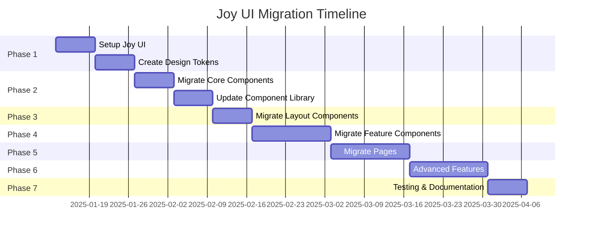

# Joy UI Migration - Business Requirements & Specifications

## Executive Summary

This document consolidates all business requirements gathered for the Radzyń City Portal Joy UI migration project. These specifications will guide the design system architecture, component mapping, and implementation roadmap.

---

## Table of Contents

1. [User Experience & Target Audience](#user-experience--target-audience)
2. [Content Strategy](#content-strategy)
3. [Functional Requirements](#functional-requirements)
4. [Performance & Technical](#performance--technical)
5. [Brand & Design](#brand--design)
6. [Future Roadmap](#future-roadmap)
7. [Content Types](#content-types)
8. [Feature Requirements Summary](#feature-requirements-summary)

---

## User Experience & Target Audience

### Primary Users
- **Residents of Radzyń Podlaski** (50%)
- **Tourists and visitors** (50%)
- Equal priority for both user groups

### Device Strategy
- **Mobile-first approach** - smartphones are primary devices
- Responsive design for tablet and desktop
- Touch-friendly targets (minimum 44x44px)

### Accessibility
- **Basic accessibility** - no advanced WCAG requirements
- Screen reader support
- Keyboard navigation
- Basic color contrast compliance

### Language Support
- **Multilingual support required**: PL, EN, DE, UA
- Language-based localization
- Language switcher component needed

---

## Content Strategy

### Content Priorities
- **All content types are equally important**: News, Events, Places, Weather, Offers

### Content Update Frequency
- **Scraping-based updates**: 2-3 times daily
- **Primary updates during daytime**
- **External content display**: Both iframe and link options
- **Automatic archiving** required for old content

### Content Sources
- Scraped from external sources (wspólnota.pl, etc.)
- Links to external sites
- Iframe embedding for external content
- AI-powered content analysis and categorization

---

## Functional Requirements

### User Accounts & Authentication
- **User accounts required** for specific features only
- **Features requiring accounts**:
  - Comments on content
  - Favorites/bookmarks
  - Content submissions
- **No authentication required** for basic browsing

### Search & Discovery
- **Full-text search with advanced filters** required
- **Complex categorization with tags** required
- **Advanced filtering** required
- **AI-powered recommendations** required

### Social Features
- **Full social sharing** required
- **Full social features** required:
  - Comments
  - Likes
  - Shares
- **Full user profiles** required
- **Full favorites system** required

### Content Management
- **Full submission forms** required for user-generated content
- **Full moderation workflow** required
- **AI moderation** required
- **Full rating and review system** required

### Export & Download
- **PDF export** required
- **Calendar export (.ics)** required

### External Content Display
- **Both iframe and link options** required
- Support for embedded external content

---

## Performance & Technical

### Performance Targets
- **LCP < 4s** - basic performance acceptable
- **Image optimization** required
- **Progressive enhancement** required

### PWA Features
- **Basic PWA features** required
- Offline support for essential content

### SEO Requirements
- **Specific SEO targets and keywords** required
- **Full SEO optimization** required (meta tags, structured data)

### Analytics & Tracking
- **Basic analytics** sufficient
- **Basic content analytics** required
- **Basic behavior tracking** required

### DevOps
- **Full CI/CD pipeline** required
- **Automated testing** required
- **Automated backup** required
- **Basic alerts** required
- **Basic error tracking** required

### Testing
- **A/B testing platform** required (not decided yet, but platform needed)

---

## Brand & Design

### Brand Guidelines
- **Use current baroque-inspired theme**
- No official brand guidelines provided
- Maintain historical heritage aesthetic

### Design Features
- **Theme switching** required
- **Basic micro-interactions** required
- **Basic touch interactions** required
- **Infinite scroll** required

### Accessibility
- **Basic accessibility** required
- Screen reader optimization
- Keyboard navigation

---

## Future Roadmap

### Planned Features (6-12 months)
- **User accounts and social features**
- Full user profile system
- Social engagement features

### No Integrations Planned
- No payment systems
- No booking systems
- No social media API integrations

---

## Content Types

### Primary Content Types

#### 1. News (Aktualności)
- Categories with complex tagging
- AI-powered categorization
- Sentiment analysis
- Reading time calculation
- Featured articles
- Source attribution

#### 2. Events (Wydarzenia)
- Calendar integration
- Event details
- Location information
- Category filtering
- Calendar export (.ics)

#### 3. Places (Miejsca)
- Interactive map
- Category-based filtering
- Detailed information (hours, contact, amenities)
- Rating and review system
- User favorites

#### 4. Weather (Pogoda)
- Current weather
- Forecast (3 days)
- Weather alerts
- Historical data

#### 5. Offers (Ogłoszenia)
- Classified advertisements
- Categories (jobs, housing, services, items)
- Advanced filtering
- Expiration system
- Community submissions

#### 6. City Information (O mieście)
- History and heritage
- Attractions
- Government information

#### 7. County Information (Powiat)
- Regional information
- Services
- Institutions

---

## Feature Requirements Summary

### Content Features

| Feature | Priority | Complexity | Notes |
|----------|-----------|------------|-------|
| News aggregation | High | Medium | Scraping + AI analysis |
| Events calendar | High | Medium | Export + filtering |
| Places directory | High | High | Map + ratings + reviews |
| Weather widget | Medium | Low | API integration |
| Offers/classifieds | High | Medium | Categories + expiration |
| City info | Medium | Low | Static content |
| County info | Medium | Low | Static content |

### User Features

| Feature | Priority | Complexity | Notes |
|----------|-----------|------------|-------|
| User accounts | Medium | Medium | For comments/favorites/submissions |
| Full user profiles | Medium | High | Preferences + history |
| Favorites system | Medium | Medium | Save content |
| Comments | Medium | Medium | On content items |
| Ratings/Reviews | Medium | Medium | On places/offers |
| Social sharing | High | Low | Full platform support |
| Content submission | Medium | Medium | Forms + moderation |

### Search & Discovery

| Feature | Priority | Complexity | Notes |
|----------|-----------|------------|-------|
| Full-text search | High | High | Advanced filters |
| Advanced filtering | High | Medium | Multiple criteria |
| Complex categorization | High | Medium | Tags + categories |
| AI recommendations | Medium | High | Content-based |
| Infinite scroll | Medium | Low | Performance impact |

### Technical Features

| Feature | Priority | Complexity | Notes |
|----------|-----------|------------|-------|
| Multilingual (PL/EN/DE/UA) | High | High | i18n system |
| Theme switching | Medium | Low | Light/dark |
| PWA basic | Medium | Medium | Offline support |
| SEO optimization | High | Medium | Meta + structured data |
| Image optimization | High | Low | Performance |
| PDF export | Medium | Low | Content generation |
| Calendar export | Medium | Low | .ics format |
| Iframe support | Medium | Medium | External content |
| AI moderation | High | High | Content filtering |

### Admin & Moderation

| Feature | Priority | Complexity | Notes |
|----------|-----------|------------|-------|
| Full moderation workflow | High | Medium | Approval process |
| AI moderation | High | High | Automated filtering |
| Automated backup | Medium | Low | Data protection |
| CI/CD pipeline | High | Medium | Deployment |
| Automated testing | High | Medium | QA process |
| Basic alerts | Medium | Low | Monitoring |
| Basic error tracking | Medium | Low | Debugging |

---

## Design System Requirements

### Color Palette
- Maintain baroque-inspired colors
- Primary: Deep navy blue (#25456B)
- Secondary: Subtle gold (#BE9C55)
- Semantic colors for success, warning, error, info
- Support for theme switching (light/dark)

### Typography
- Display font: Playfair Display (serif)
- Body font: Source Sans Pro / Montserrat (sans-serif)
- Responsive typography scale
- Support for PL, EN, DE, UA character sets

### Spacing System
- Mobile-first spacing scale
- Consistent spacing tokens
- Touch-friendly spacing (minimum 16px)

### Component Variants
- Button variants: solid, soft, outlined, plain
- Card variants: outlined, elevated, flat
- Input variants: standard, with validation states
- Chip variants: filled, outlined, soft

### Responsive Breakpoints
- Mobile: < 640px
- Tablet: 640px - 1024px
- Desktop: > 1024px
- Large desktop: > 1440px

---

## Mock Data Requirements

### News Mock Data
- 10-15 sample articles
- Multiple categories
- AI analysis data (sentiment, keywords, reading time)
- Tags and categories
- Featured and regular articles

### Events Mock Data
- 8-10 sample events
- Date ranges
- Categories (cultural, sports, educational, business)
- Location information
- Calendar export data

### Places Mock Data
- 15-20 sample places
- All categories (Zabytki, Kultura, Sport, etc.)
- Opening hours
- Contact information
- Amenities
- Ratings and reviews

### Offers Mock Data
- 10-15 sample offers
- Categories (jobs, housing, services, items)
- Expiration dates
- Contact information
- Images

### User Mock Data
- 5-10 sample users
- Profiles with preferences
- Favorites lists
- Comment history

---

## Migration Priorities

### Phase 1: Foundation (Week 1-2)
- Install Joy UI dependencies
- Create Joy UI theme with design tokens
- Set up design token utilities
- Update ThemeRegistry
- Remove Tailwind CSS

### Phase 2: Core Components (Week 3-4)
- Migrate Button component
- Migrate Input/TextField components
- Migrate Card components
- Migrate Chip component
- Migrate Alert component
- Migrate Skeleton component

### Phase 3: Layout Components (Week 5)
- Migrate Navigation component
- Migrate Dashboard component
- Migrate DashboardWidget component
- Update layout.tsx

### Phase 4: Feature Components (Week 6-7)
- Migrate NewsCard component
- Migrate EventCard component
- Migrate WeatherWidget component
- Migrate ContactForm component
- Migrate NewsFeed component
- Migrate CityHighlights component

### Phase 5: Pages Migration (Week 8-9)
- Migrate homepage
- Migrate city page
- Migrate county page
- Migrate map page
- Migrate places page
- Migrate events page
- Migrate news page
- Migrate contact page
- Migrate weather page
- Migrate admin pages

### Phase 6: Advanced Features (Week 10)
- Implement multilingual support
- Implement theme switching
- Implement user accounts
- Implement favorites system
- Implement comments system
- Implement ratings/reviews
- Implement social sharing
- Implement content submission forms
- Implement moderation workflow
- Implement AI moderation
- Implement search with filters
- Implement AI recommendations
- Implement infinite scroll
- Implement PDF export
- Implement calendar export
- Implement iframe support
- Implement PWA features
- Implement SEO optimization
- Implement image optimization
- Implement CI/CD pipeline
- Implement automated testing
- Implement automated backup
- Implement basic alerts
- Implement error tracking
- Implement A/B testing platform

### Phase 7: Testing & Documentation (Week 11)
- Component testing
- Visual regression testing
- Performance testing
- Cross-browser testing
- Accessibility testing
- Bug fixes
- Create component documentation
- Create design system documentation
- Update README
- Create migration guide
- Team training

---

## Success Criteria

### Functional Requirements
- [ ] All components migrated to Joy UI
- [ ] Design tokens implemented consistently
- [ ] Multilingual support (PL/EN/DE/UA)
- [ ] Theme switching implemented
- [ ] User accounts implemented
- [ ] Favorites system implemented
- [ ] Comments system implemented
- [ ] Ratings/reviews implemented
- [ ] Social sharing implemented
- [ ] Content submission forms implemented
- [ ] Moderation workflow implemented
- [ ] AI moderation implemented
- [ ] Search with filters implemented
- [ ] AI recommendations implemented
- [ ] Infinite scroll implemented
- [ ] PDF export implemented
- [ ] Calendar export implemented
- [ ] Iframe support implemented
- [ ] PWA features implemented
- [ ] SEO optimization implemented
- [ ] Image optimization implemented
- [ ] CI/CD pipeline implemented
- [ ] Automated testing implemented
- [ ] Automated backup implemented
- [ ] Basic alerts implemented
- [ ] Error tracking implemented
- [ ] A/B testing platform implemented

### Non-Functional Requirements
- [ ] No visual regressions
- [ ] Performance maintained or improved (LCP < 4s)
- [ ] Accessibility compliance verified
- [ ] Documentation completed
- [ ] Team trained on Joy UI
- [ ] Code review approved

---

## Risk Assessment

| Risk | Impact | Probability | Mitigation Strategy |
|-------|----------|-------------|-------------------|
| Breaking changes in Joy UI | High | Low | Use stable version, test thoroughly |
| Performance regression | Medium | Medium | Monitor bundle size, optimize imports |
| Design inconsistencies | High | Medium | Use design tokens, create style guide |
| Component compatibility issues | Medium | Low | Test all components, create adapters |
| Timeline delays | Medium | Medium | Buffer time, prioritize critical features |
| Multilingual complexity | High | High | Plan i18n architecture early |
| AI moderation accuracy | Medium | Medium | Implement fallback to manual moderation |

---

## Team Structure

### Team Composition
- **3-5 developers**
- **Mixed experience levels**
- **UX Developer** (lead)
- **Mid-level developers** (implementation)
- **Business Analyst** (requirements)

### Roles & Responsibilities

| Role | Responsibilities |
|-------|----------------|
| UX Developer | Design system architecture, component mapping, design principles |
| Mid-level Developers | Component migration, page updates, feature implementation |
| Business Analyst | Requirements gathering, stakeholder communication, validation |

---

## Timeline

### Overall Timeline: 3-4 months (moderate)

---

## Next Steps

1. **Review and approve** this specifications document
2. **Approve migration plan** from [`joy-ui-migrate-task.md`](joy-ui-migrate-task.md)
3. **Set up development environment** with Joy UI
4. **Begin Phase 1**: Foundation setup
5. **Weekly progress reviews** with stakeholders
6. **Adjust timeline** based on team velocity

---

## Appendix

### A. Joy UI Resources
- [Joy UI Documentation](https://mui.com/joy-ui/getting-started/)
- [Joy UI Components](https://mui.com/joy-ui/react-components/)
- [Joy UI Theming](https://mui.com/joy-ui/customization/theming/)

### B. Migration Checklist
- [ ] Install Joy UI dependencies
- [ ] Create Joy UI theme
- [ ] Set up design tokens
- [ ] Migrate core components
- [ ] Migrate layout components
- [ ] Migrate feature components
- [ ] Migrate pages
- [ ] Remove Tailwind CSS
- [ ] Test all components
- [ ] Update documentation
- [ ] Train team

### C. Contact Information
- **Project Lead**: [Name]
- **UX Developer**: [Name]
- **Business Analyst**: [Name]
- **Tech Lead**: [Name]

---

*Document Version: 1.0*
*Last Updated: 2025-01-11*
*Next Review: 2025-01-18*
